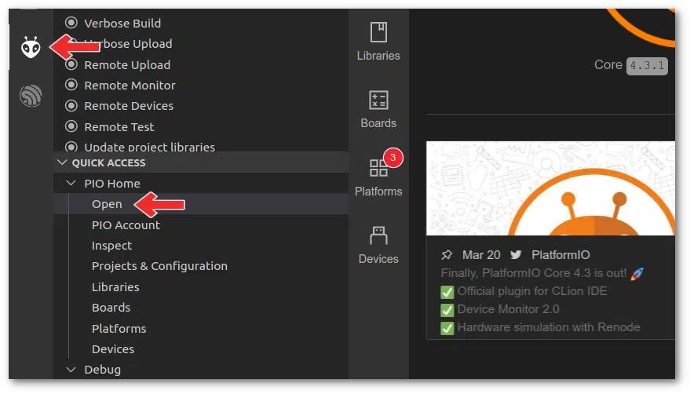

# Como programar o Arduino com o Visual Studio Code e PlatformIO IDE

## Instalação do VSCode
Acesse [este link](https://code.visualstudio.com/) baixar para sua plataforma (Windows, Linux ou Mac) e prosseguir normalmente com a instalação.

## Instalando a extensão PlatformIO para VS Code
O VS Code possui uma seção onde é possível instalar extensões. Existem extensões oficiais e outras desenvolvidas por outros desenvolvedores. Até você pode desenvolver sua extensão.

Assim que o VS Code for instalado, clique na seção extensões e pesquise por “**platformio**”. Selecione a extensão do PlatformIO e clique no pequeno botão verde instalar.

Após a instalação, veja que agora o VS Code tem um **ícone do PlatformIO à esquerda.**

## Criando um novo projeto para ESP32

Com tudo instalado podemos mostrar como programar ESP32 com VS Code e PlatformIO criando um novo projeto. Para isso clique no **ícone do PlatformIO** criado à esquerda e então clique em “**PIO Home**” e depois em “**Open**”.

Na janela Home do PlatoformIO, clique em “**New Project**”, dê um nome para seu projeto, escolha a placa “**Espressif ESP32 Dev Module**” e “**Framework Arduino**”.

Clique em “**Finish**” para finalizar a criação do novo projeto.

Com isso foi criada uma estrutura de projeto contendo as pastas e arquivos necessários.

