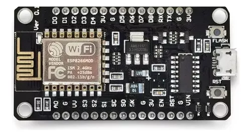
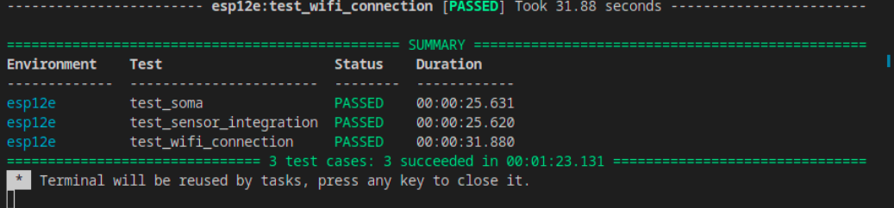

# Teste Software

## Objetivo, Escopo e Motivação para a Pesquisa

O objetivo principal desta pesquisa foi explorar a automação de tarefas relacionadas aos testes de software em sistemas embarcados, com ênfase no uso da ferramenta PlatformIO para criação e execução de testes. O foco esteve na criação de três testes automatizados: dois testes de integração e um teste de funcionalidade. O tema está alinhado à crescente necessidade de garantir confiabilidade e eficiência em sistemas embarcados, especialmente em aplicações críticas como IoT e dispositivos conectados.

A motivação decorre da complexidade inerente ao desenvolvimento de software embarcado, onde o comportamento final depende de uma interação eficiente entre hardware e software. Testes manuais podem ser demorados e suscetíveis a erros, o que justifica a automação como uma abordagem essencial para melhorar a produtividade e a qualidade do produto.

## O que é PlatformIO?

é um ecossistema de desenvolvimento integrado (IDE) para a programação de sistemas embarcados. Ele oferece um conjunto de ferramentas e bibliotecas que facilitam o desenvolvimento, teste, compilação e depuração de firmware para microcontroladores e sistemas embarcados.

### Benefícios:

**Agilidade**: Simplifica o processo de configuração e desenvolvimento, permitindo que os desenvolvedores foquem no código.<br>
**Versatilidade**: Ideal tanto para projetos simples quanto para sistemas complexos.<br>
**Comunidade ativa**: Possui uma ampla base de usuários e documentação robusta.<br>

### Principais características do PlatformIO:

1. Compatibilidade com diversos microcontroladores e placas:
  - Suporta uma ampla variedade de plataformas, incluindo Arduino, ESP32, STM32, AVR, Nordic, entre outras.
  - Oferece uma API unificada para lidar com diferentes placas e arquiteturas.
2. Gerenciamento de bibliotecas:
  - Possui um gerenciador de bibliotecas que facilita a instalação e manutenção de dependências.
3. Configuração através de arquivos simples:
  - O arquivo `platformio.ini` é usado para configurar o projeto, especificando a plataforma, framework, e outros parâmetros.
4. Automação de build e CI/CD:
 - Suporte a scripts personalizados e integração com sistemas de integração contínua (CI/CD).

## Configurando o Ambiente de Testes com PlatformIO

O **PlatformIO** pode ser [instalado](PlatformIO_instalado.md) como uma extensão no **Visual Studio Code** ou diretamente pela linha de comando. A instalação pode ser feita via **pip**:

```bash
pip install platformio
```

Após a instalação, crie um novo projeto utilizando o comando:

```bash
platformio init --board esp12e  # ou outra placa específica que você esteja utilizando
```

Isso criará a estrutura básica do projeto, incluindo o arquivo de configuração `platformio.ini`.

### 2. Estrutura de Testes no PlatformIO

No PlatformIO, os testes de integração são escritos em uma pasta chamada `test/` dentro do seu projeto. Cada subpasta em `test/` representa um conjunto de testes. O código de teste pode ser implementado usando bibliotecas como **Unity**, que o PlatformIO oferece como padrão.

A estrutura básica de um projeto de testes de integração seria algo como:

```bash
project/
|-- src/
|   |-- main.cpp       # Código principal do projeto
|-- test/
|   |-- test_integration/
|       |-- test_integration.cpp  # Código de teste de integração
|-- platformio.ini     # Arquivo de configuração do PlatformIO
```
## Descrição do que foi feito

Placa Usada no experimento


 1. Estruturação do Projeto no PlatformIO
   - Configuração inicial do ambiente de desenvolvimento utilizando PlatformIO, um ecossistema ideal para desenvolvimento e testes em dispositivos embarcados como ESP8266.
   - Configuração do arquivo platformio.ini para suportar diversas configuraces de board, incluindo parâmetros de upload e logs.
 2. Desenvolvimento dos Testes
   - Testes de Integração:
     - Teste de Conexão Wi-Fi: Validou a capacidade do dispositivo de conectar-se a uma rede Wi-Fi com SSID e senha válidos.
   - Teste de Funcionalidade:
     <!-- - Verificou o comportamento do LED embutido (LED_BUILTIN), testando se ele acende e apaga conforme esperado em um cenário de operação básico. -->
     - Verificou tambe o comportamento de uma funcao matematica que onde recebe dois valores retorna a soma.
 3. Execução e Resultados
   - Os testes foram executados no hardware real (ESP8266).
   - Resultados foram coletados automaticamente e mostrados no console do PlatformIO, evidenciando o sucesso ou falha de cada caso de teste.


## Benefícios de Automação de Testes com PlatformIO
   - Redução de Erros: Detecta bugs rapidamente ao automatizar testes durante o desenvolvimento.
   - Eficiência: Permite executar centenas de testes em diferentes ambientes rapidamente.
   - Reprodutibilidade: Configurações centralizadas garantem que todos os desenvolvedores ou pipelines usem os mesmos parâmetros.
   - Qualidade do Código: Integração com CI/CD mantém a qualidade em um ciclo contínuo.

## Conclusão
A pesquisa demonstrou que o uso do PlatformIO é uma abordagem eficaz para automação de testes em sistemas embarcados. Os três testes desenvolvidos permitiram validar tanto a integração entre hardware e software quanto funcionalidades específicas. 

Os principais benefícios observados foram:

- Redução do tempo de teste devido à automação.
- Maior confiabilidade nos resultados, eliminando a interferência de erros humanos comuns em testes manuais.

Dificuldades e Desafios:

<!-- Falta de Documentação Detalhada: Encontrar materiais específicos sobre automação de testes com PlatformIO foi desafiador, especialmente para casos de integração com hardware.  -->
- Hardware Limitado: O acesso restrito a dispositivos compatíveis (apenas um ESP8266) limitou os experimentos a um único ambiente fisico, dificultando a generalização dos resultados.


## Referencias
https://platformio.org/<br>
https://docs.platformio.org/en/latest/advanced/unit-testing/index.html<br>
https://embarcados.com.br/arduino-vscode-platformio/<br>

